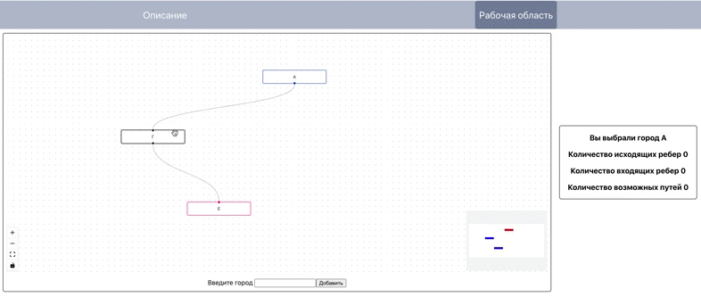

На рисунке — схема дорог, связывающих города А, Б, В, Г, Д, Е. По каждой дороге можно двигаться только в одном направлении, указанном стрелкой. Сколько существует различных путей из города А в город Е? 
.  
.  
   
          
